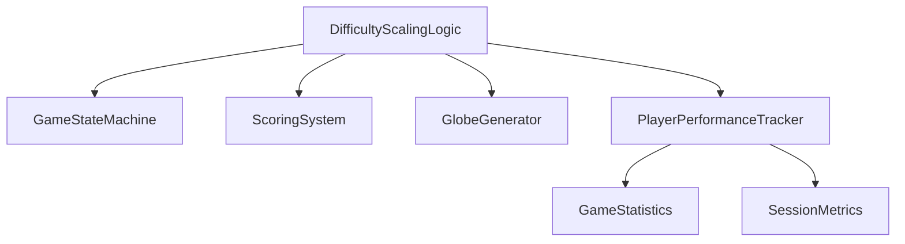

# Difficulty Scaling Logic - Technical Design

## 1. Overview

The Difficulty Scaling Logic will dynamically adjust gameplay parameters based on player performance and progression. This system will interface with the existing Game State Machine, Scoring System, and Globe Generator to create a responsive and engaging gameplay experience.

## 2. Architecture Design

### 2.1 Core Components



### 2.2 Difficulty Scaling Logic Class

```gdscript
class_name DifficultyScalingLogic
extends Node

# Configuration parameters
@export var base_difficulty: float = 1.0
@export var difficulty_increase_rate: float = 0.1
@export var difficulty_decrease_rate: float = 0.05
@export var max_difficulty: float = 5.0
@export var min_difficulty: float = 0.5

# Current state
var current_difficulty: float = 1.0
var player_performance_score: float = 0.0
var consecutive_wins: int = 0
var consecutive_losses: int = 0

# Performance tracking
var performance_history: Array = []
var last_adjustment_time: float = 0.0

# Signals
signal difficulty_changed(new_difficulty: float)
signal performance_updated(new_score: float)
```

## 3. Interface Definitions

### 3.1 Interface with Game State Machine

The Difficulty Scaling Logic will integrate with the existing Game State Machine in `main.gd`:

**Integration Points:**

- Game state transitions (MENU → PLAYING, PLAYING → GAME_OVER)
- Game initialization and reset
- Real-time difficulty adjustments during gameplay

**Required Modifications to main.gd:**

```gdscript
# Add difficulty scaling logic instance
var difficulty_scaling: DifficultyScalingLogic

# In _ready():
difficulty_scaling = DifficultyScalingLogic.new()
add_child(difficulty_scaling)
difficulty_scaling.difficulty_changed.connect(_on_difficulty_changed)

# In change_state():
match new_state:
    GameState.PLAYING:
        difficulty_scaling.start_game_session()
    GameState.GAME_OVER:
        difficulty_scaling.end_game_session(is_win)
```

### 3.2 Interface with Scoring System

The Difficulty Scaling Logic will use the existing statistics system and extend it:

**Performance Metrics:**

- Time to complete game
- Number of flags used vs. mines
- Accuracy (safe tiles revealed vs. total safe tiles)
- Win/loss ratio
- Current streak

**Scoring Formula:**

```gdscript
func calculate_performance_score() -> float:
    var time_factor = clamp(1.0 - (game_timer / max(game_statistics.best_time * 2, game_timer)), 0.0, 1.0)
    var accuracy_factor = safe_tiles_revealed / max(total_safe_tiles, 1)
    var streak_factor = clamp(game_statistics.current_streak / 10.0, 0.0, 1.0)
    
    return (time_factor * 0.4) + (accuracy_factor * 0.4) + (streak_factor * 0.2)
```

### 3.3 Interface with Globe Generator

The Difficulty Scaling Logic will modify globe generation parameters:

**Adjustable Parameters:**

- `globe_radius`: Globe size (affects visual complexity)
- `subdivision_level`: Number of tiles (affects game complexity)
- `mine_percentage`: Mine density (affects difficulty)
- `tile_scale`: Tile size (affects visual density)

**Difficulty Mapping:**

```gdscript
func apply_difficulty_to_globe():
    # Base values
    var base_radius = 20.0
    var base_subdivision = 3
    var base_mine_percentage = 0.15
    
    # Scale with difficulty
    globe_generator.globe_radius = base_radius * (1.0 + (current_difficulty - 1.0) * 0.2)
    globe_generator.subdivision_level = floor(base_subdivision + (current_difficulty - 1.0) * 2)
    globe_generator.mine_percentage = base_mine_percentage * current_difficulty
    
    # Ensure values stay within reasonable bounds
    globe_generator.globe_radius = clamp(globe_generator.globe_radius, 15.0, 30.0)
    globe_generator.subdivision_level = clamp(globe_generator.subdivision_level, 2, 6)
    globe_generator.mine_percentage = clamp(globe_generator.mine_percentage, 0.1, 0.3)
```

## 4. Difficulty Calculation Algorithm

### 4.1 Performance-Based Scaling

```gdscript
func update_difficulty_based_on_performance():
    var performance_score = calculate_performance_score()
    
    # Adjust difficulty based on performance
    if performance_score > 0.8:  # Excellent performance
        current_difficulty = min(current_difficulty + difficulty_increase_rate, max_difficulty)
        consecutive_wins += 1
        consecutive_losses = 0
    elif performance_score < 0.4:  # Poor performance
        current_difficulty = max(current_difficulty - difficulty_decrease_rate, min_difficulty)
        consecutive_losses += 1
        consecutive_wins = 0
    
    # Apply streak-based adjustments
    if consecutive_wins >= 3:
        current_difficulty = min(current_difficulty + difficulty_increase_rate * 2, max_difficulty)
    elif consecutive_losses >= 2:
        current_difficulty = max(current_difficulty - difficulty_decrease_rate * 2, min_difficulty)
    
    # Emit signal for UI updates
    difficulty_changed.emit(current_difficulty)
```

### 4.2 Time-Based Scaling

```gdscript
func update_difficulty_over_time(delta: float):
    # Gradual increase over time to keep players engaged
    if current_state == GameState.PLAYING:
        var time_elapsed = Time.get_unix_time_from_system() - last_adjustment_time
        if time_elapsed > 60.0:  # Adjust every minute
            current_difficulty = min(current_difficulty + (difficulty_increase_rate * 0.5), max_difficulty)
            last_adjustment_time = Time.get_unix_time_from_system()
            difficulty_changed.emit(current_difficulty)
```

## 5. Implementation Tasks

### 5.1 Core Implementation

1. **Create DifficultyScalingLogic class** (`scripts/difficulty_scaling.gd`)
   - Implement core difficulty calculation algorithms
   - Add performance tracking functionality
   - Implement signal system for state changes

2. **Integrate with Game State Machine**
   - Modify `main.gd` to instantiate and connect DifficultyScalingLogic
   - Update `change_state()` function to notify difficulty system
   - Add difficulty adjustment calls in game loop

3. **Extend Scoring System**
   - Add performance metrics calculation
   - Implement difficulty-based score modifiers
   - Update statistics tracking with difficulty data

4. **Modify Globe Generator Interface**
   - Add functions to apply difficulty parameters
   - Ensure parameter validation and bounds checking
   - Update globe generation to use dynamic parameters

### 5.2 UI Integration

1. **Add Difficulty Display**
   - Update HUD to show current difficulty level
   - Add visual indicators for difficulty changes
   - Implement difficulty progression feedback

2. **Add Settings Options**
   - Allow players to configure difficulty scaling behavior
   - Add options for fixed vs. dynamic difficulty
   - Implement difficulty cap settings

### 5.3 Testing and Validation

1. **Implement Test Scenarios**
   - Create test cases for different performance levels
   - Validate difficulty scaling behavior
   - Test edge cases and boundary conditions

2. **Performance Testing**
   - Ensure no performance impact from difficulty calculations
   - Validate globe generation with dynamic parameters
   - Test memory usage with extended play sessions

## 6. Technical Specifications

### 6.1 Class Structure

```gdscript
# DifficultyScalingLogic.gd
class_name DifficultyScalingLogic
extends Node

# Configuration
@export var base_difficulty: float = 1.0
@export var difficulty_increase_rate: float = 0.1
@export var difficulty_decrease_rate: float = 0.05
@export var max_difficulty: float = 5.0
@export var min_difficulty: float = 0.5
@export var performance_history_size: int = 10

# State
var current_difficulty: float = 1.0
var player_performance_score: float = 0.0
var consecutive_wins: int = 0
var consecutive_losses: int = 0
var performance_history: Array = []
var last_adjustment_time: float = 0.0

# Signals
signal difficulty_changed(new_difficulty: float)
signal performance_updated(new_score: float)

# Methods
func start_game_session():
    # Reset session-specific tracking
    pass

func end_game_session(is_win: bool, game_data: Dictionary):
    # Update performance metrics and adjust difficulty
    pass

func calculate_performance_score(game_data: Dictionary) -> float:
    # Calculate based on time, accuracy, streak, etc.
    pass

func update_difficulty():
    # Adjust difficulty based on current performance
    pass

func apply_difficulty_to_globe(globe_generator: GlobeGenerator):
    # Modify globe parameters based on current difficulty
    pass

func get_current_difficulty() -> float:
    return current_difficulty
```

### 6.2 Integration Points

**main.gd modifications:**

```gdscript
# Add to _ready():
difficulty_scaling = DifficultyScalingLogic.new()
add_child(difficulty_scaling)
difficulty_scaling.difficulty_changed.connect(_on_difficulty_changed)

# Add to _process(delta):
if current_state == GameState.PLAYING:
    difficulty_scaling.update_difficulty_over_time(delta)

# Add to change_state(new_state):
match new_state:
    GameState.PLAYING:
        difficulty_scaling.start_game_session()
    GameState.GAME_OVER:
        var game_data = {
            "time": game_timer,
            "is_win": is_win,
            "safe_tiles_revealed": safe_tiles_revealed,
            "total_safe_tiles": total_safe_tiles
        }
        difficulty_scaling.end_game_session(is_win, game_data)

# Add callback:
func _on_difficulty_changed(new_difficulty: float):
    # Update UI and apply difficulty settings
    ui.update_difficulty(new_difficulty)
    # Could also trigger visual effects or audio cues
```

## 7. Expected Outcomes

1. **Dynamic Gameplay**: Game difficulty adapts to player skill level
2. **Increased Engagement**: Players remain challenged but not frustrated
3. **Personalized Experience**: Game adapts to individual play styles
4. **Extended Playability**: Progressive difficulty keeps game interesting over time
5. **Data-Driven Balancing**: Performance metrics enable fine-tuning of difficulty curves

## 8. Future Enhancements

1. **Machine Learning Integration**: Use player behavior patterns for more sophisticated scaling
2. **Multiplayer Balancing**: Adapt difficulty based on multiple players' performance
3. **Content Unlocking**: Tie difficulty milestones to unlockable features
4. **Adaptive Tutorials**: Provide targeted hints based on performance weaknesses
5. **Difficulty Profiles**: Allow players to save and load different difficulty configurations

## 9. Implementation Timeline

| Phase | Task | Estimated Time |
|-------|------|---------------|
| 1 | Core class implementation | 2-4 hours |
| 2 | Game State Machine integration | 1-2 hours |
| 3 | Scoring System extension | 1-2 hours |
| 4 | Globe Generator modifications | 1-2 hours |
| 5 | UI Integration | 1-2 hours |
| 6 | Testing and validation | 2-4 hours |
| 7 | Bug fixing and optimization | 1-2 hours |
| **Total** | | **10-18 hours** |

## 10. Success Metrics

1. **Difficulty Range**: System successfully scales between min and max difficulty bounds
2. **Performance Correlation**: Difficulty adjustments correlate with player performance metrics
3. **Stability**: No crashes or errors during extended play sessions
4. **User Satisfaction**: Players report appropriate challenge level (via testing feedback)
5. **Engagement Metrics**: Increased play time and session frequency (long-term metric)
