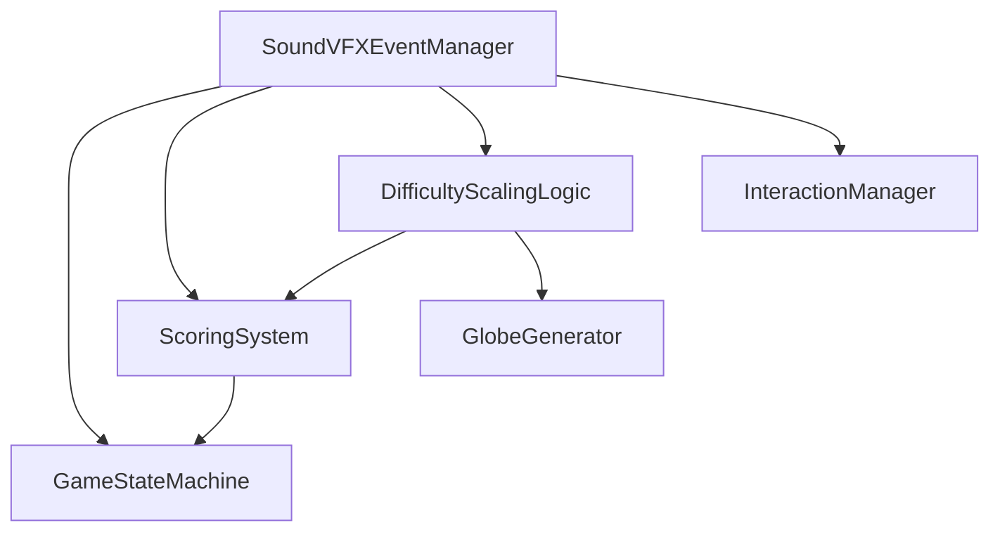
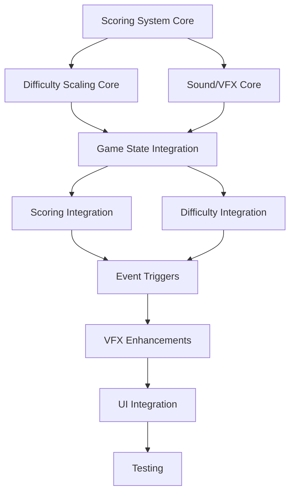

# GlobeSweeper 3D - Phase 7 Implementation Plan

## 1. Overview

Phase 7 will implement three major systems that work together to create a more dynamic, engaging, and polished gameplay experience:

1. **Scoring System Enhancement** - Extends the existing statistics system with performance-based scoring
2. **Difficulty Scaling Logic** - Dynamically adjusts gameplay based on player performance
3. **Sound/VFX Event Manager** - Centralized audio-visual feedback system

## 2. System Integration Architecture



## 3. Implementation Sequence

### 3.1 Phase 1: Core System Implementation (8-12 hours)

#### Task 1.1: Scoring System Enhancement (2-3 hours)

- **Files**: `scripts/main.gd`, `scripts/scoring_system.gd`
- **Dependencies**: None
- **Implementation**:
  - Create `ScoringSystem` class with performance metrics
  - Extend `game_statistics` with difficulty-based scoring
  - Add accuracy, time efficiency, and streak calculations
  - Implement score modifiers based on difficulty level

#### Task 1.2: Difficulty Scaling Logic (3-4 hours)

- **Files**: `scripts/difficulty_scaling.gd`
- **Dependencies**: Scoring System (Task 1.1)
- **Implementation**:
  - Create `DifficultyScalingLogic` class with core algorithms
  - Implement performance-based and time-based scaling
  - Add parameter validation and bounds checking
  - Integrate with existing game statistics

#### Task 1.3: Sound/VFX Event Manager Core (3-5 hours)

- **Files**: `scripts/sound_vfx_manager.gd`, `scripts/vfx_system.gd`
- **Dependencies**: None
- **Implementation**:
  - Create `SoundVFXEventManager` class with event queue
  - Implement `VFXSystem` with particle configurations
  - Add priority-based event processing
  - Create event type enum and processing methods

### 3.2 Phase 2: System Integration (6-8 hours)

#### Task 2.1: Game State Machine Integration (2-3 hours)

- **Files**: `scripts/main.gd`
- **Dependencies**: All core systems (Phase 1)
- **Implementation**:
  - Instantiate all three new systems in `_ready()`
  - Connect signals between systems
  - Modify `change_state()` to trigger appropriate events
  - Add event processing to `_process()` loop

#### Task 2.2: Scoring System Integration (1-2 hours)

- **Files**: `scripts/main.gd`, `scripts/scoring_system.gd`
- **Dependencies**: Task 2.1
- **Implementation**:
  - Connect scoring system to difficulty scaling
  - Add performance metrics calculation
  - Implement difficulty-based score modifiers
  - Update statistics tracking with difficulty data

#### Task 2.3: Difficulty System Integration (2-3 hours)

- **Files**: `scripts/main.gd`, `scripts/difficulty_scaling.gd`, `scripts/globe_generator.gd`
- **Dependencies**: Task 2.1, Task 2.2
- **Implementation**:
  - Modify globe generator to accept dynamic parameters
  - Add difficulty adjustment calls in game loop
  - Implement difficulty change callbacks
  - Add UI integration for difficulty display

### 3.3 Phase 3: Event System Implementation (4-6 hours)

#### Task 3.1: Event Triggers Implementation (2-3 hours)

- **Files**: `scripts/main.gd`, `scripts/sound_vfx_manager.gd`
- **Dependencies**: Phase 2 complete
- **Implementation**:
  - Add event triggers for tile interactions
  - Implement game state change events
  - Add scoring and streak event triggers
  - Create difficulty change event handling

#### Task 3.2: VFX Enhancements (2-3 hours)

- **Files**: `scripts/vfx_system.gd`, `shaders/tile.gdshader`
- **Dependencies**: Task 3.1
- **Implementation**:
  - Add difficulty-based fireworks variations
  - Implement streak-based celebrations
  - Enhance tile visual effects
  - Add screen shake and camera effects

### 3.4 Phase 4: UI Integration (3-4 hours)

#### Task 4.1: Settings and Controls (1-2 hours)

- **Files**: `scripts/ui.gd`, UI scenes
- **Dependencies**: Phase 3 complete
- **Implementation**:
  - Add sound/VFX toggle controls
  - Implement volume and intensity sliders
  - Add difficulty scaling configuration options
  - Create visual feedback indicators

#### Task 4.2: Visual Feedback (1-2 hours)

- **Files**: `scripts/ui.gd`, HUD scenes
- **Dependencies**: Task 4.1
- **Implementation**:
  - Add difficulty level display
  - Implement streak indicators
  - Create event notifications
  - Add difficulty change animations

### 3.5 Phase 5: Testing and Validation (6-8 hours)

#### Task 5.1: Unit Testing (2-3 hours)

- **Files**: All new system files
- **Dependencies**: All implementation complete
- **Implementation**:
  - Test individual system components
  - Validate event processing and priority
  - Verify difficulty scaling algorithms
  - Test scoring calculations

#### Task 5.2: Integration Testing (2-3 hours)

- **Files**: All modified files
- **Dependencies**: Task 5.1
- **Implementation**:
  - Test system interactions
  - Validate complete gameplay flow
  - Verify UI integration
  - Test edge cases and boundary conditions

#### Task 5.3: Performance Testing (2-2 hours)

- **Files**: All systems
- **Dependencies**: Task 5.2
- **Implementation**:
  - Measure event processing overhead
  - Test particle system performance
  - Validate audio generation impact
  - Ensure 60+ FPS maintained

## 4. Task Dependencies



## 5. Timeline Estimates

| Phase | Task Group | Estimated Time | Dependencies |
|-------|------------|----------------|--------------|
| 1 | Core System Implementation | 8-12 hours | None |
| 2 | System Integration | 6-8 hours | Phase 1 |
| 3 | Event System Implementation | 4-6 hours | Phase 2 |
| 4 | UI Integration | 3-4 hours | Phase 3 |
| 5 | Testing and Validation | 6-8 hours | Phases 1-4 |
| **Total** | **Complete Implementation** | **27-38 hours** | |

## 6. Critical Path

The critical path follows the dependency chain:

1. Scoring System Core (2-3h)
2. Difficulty Scaling Core (3-4h)
3. Game State Integration (2-3h)
4. Event Triggers Implementation (2-3h)
5. Integration Testing (2-3h)

**Critical Path Total: 11-16 hours**

## 7. Resource Allocation

### 7.1 File Creation

- `scripts/scoring_system.gd` - New scoring system
- `scripts/difficulty_scaling.gd` - Difficulty scaling logic
- `scripts/sound_vfx_manager.gd` - Event manager
- `scripts/vfx_system.gd` - Visual effects system

### 7.2 File Modifications

- `scripts/main.gd` - Game state machine integration
- `scripts/globe_generator.gd` - Dynamic parameter support
- `scripts/ui.gd` - UI enhancements
- `shaders/tile.gdshader` - Enhanced visual effects
- Various UI scene files

## 8. Risk Assessment

### 8.1 High Risk Items

- **System Integration Complexity**: Multiple systems interacting
- **Performance Impact**: Event processing overhead
- **Dependency Management**: Circular dependencies between systems

### 8.2 Mitigation Strategies

- **Modular Testing**: Test each system independently first
- **Performance Profiling**: Regular performance checks during development
- **Interface Design**: Clear system boundaries and APIs

## 9. Success Criteria

### 9.1 Technical Success

- All systems integrated without crashes
- 60+ FPS maintained on target hardware
- Event processing latency < 16ms (one frame)
- Memory usage increase < 20MB

### 9.2 Functional Success

- Difficulty scales appropriately with player performance
- All gameplay events have appropriate audio/visual feedback
- Scoring system accurately reflects player skill
- UI provides clear feedback on all system states

### 9.3 User Experience Success

- Players report appropriate challenge level
- Audio/visual feedback enhances immersion
- Difficulty progression feels natural
- Settings provide meaningful customization

## 10. Implementation Recommendations

### 10.1 Development Order

1. Implement core systems independently
2. Integrate with game state machine
3. Add cross-system interactions
4. Implement UI and feedback
5. Test and optimize

### 10.2 Best Practices

- Use signals for system communication
- Implement bounds checking for all parameters
- Add comprehensive error handling
- Include performance monitoring
- Document all system interfaces

### 10.3 Testing Strategy

- Unit test each system component
- Integration test system interactions
- Performance test with various configurations
- User testing for feel and balance

## 11. Future Enhancements

### 11.1 Post-Phase 7 Features

- Machine learning for adaptive difficulty
- Procedural audio generation
- Advanced VFX shaders
- Multiplayer difficulty balancing
- Accessibility options

### 11.2 Long-Term Roadmap

- Content unlocking tied to difficulty milestones
- Adaptive tutorials based on performance
- Difficulty profiles and presets
- Seasonal sound/VFX themes
- Haptic feedback integration

## 12. Appendix: System Interfaces

### 12.1 Scoring System Interface

```gdscript
# Expected methods
calculate_performance_score(game_data: Dictionary) -> float
update_difficulty_based_score(difficulty: float, base_score: float) -> float
get_current_score() -> float
```

### 12.2 Difficulty Scaling Interface

```gdscript
# Expected methods
adjust_difficulty(performance_score: float, game_data: Dictionary)
apply_difficulty_to_globe(globe_generator: GlobeGenerator)
get_current_difficulty() -> float
```

### 12.3 Sound/VFX Event Manager Interface

```gdscript
# Expected methods
trigger_event(event_type: EventType, data: Dictionary = {}, priority: EventPriority = EventPriority.MEDIUM)
process_events(delta: float)
play_sound_effect(sound_type: String, volume: float = 1.0)
play_visual_effect(vfx_type: String, position: Vector3 = Vector3.ZERO, scale: float = 1.0)
```

## 13. Implementation Checklist

- [ ] Create ScoringSystem class
- [ ] Create DifficultyScalingLogic class
- [ ] Create SoundVFXEventManager class
- [ ] Create VFXSystem class
- [ ] Integrate systems with GameStateMachine
- [ ] Add event triggers throughout gameplay
- [ ] Implement UI controls and feedback
- [ ] Test all system interactions
- [ ] Optimize performance
- [ ] Document final implementation

This comprehensive plan provides a clear roadmap for implementing Phase 7, ensuring all three systems work together harmoniously to create an enhanced gameplay experience.
