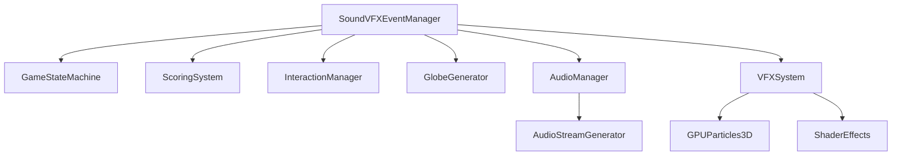

# Sound/VFX Event Manager - Technical Design

## 1. Overview

The Sound/VFX Event Manager will centralize and enhance audio-visual feedback in GlobeSweeper 3D. This system will build upon the existing `AudioManager` and fireworks implementation, providing a more comprehensive and extensible framework for managing sound effects and visual effects triggered by gameplay events.

## 2. Architecture Design

### 2.1 Core Components



### 2.2 SoundVFXEventManager Class

```gdscript
class_name SoundVFXEventManager
extends Node

# Event types enum
enum EventType {
    TILE_REVEAL,
    TILE_FLAG,
    MINE_EXPLOSION,
    GAME_WIN,
    GAME_LOSE,
    GAME_START,
    GAME_PAUSE,
    GAME_RESUME,
    DIFFICULTY_CHANGE,
    STREAK_UPDATE,
    CHORD_REVEAL,
    FIRST_CLICK,
    GLOBE_ROTATION,
    ZOOM_CHANGE
}

# Configuration parameters
@export var sound_enabled: bool = true
@export var vfx_enabled: bool = true
@export var master_volume: float = 1.0
@export var sfx_volume: float = 0.8
@export var vfx_intensity: float = 1.0

# References to other systems
var audio_manager: AudioManager
var vfx_system: VFXSystem
var game_state_machine: Node
var scoring_system: Dictionary
var interaction_manager: InteractionManager

# Event queue for processing
var event_queue: Array = []

# Signals
signal event_triggered(event_type: EventType, data: Dictionary)
signal vfx_played(vfx_type: String, position: Vector3)
signal sound_played(sound_type: String)

# Methods
func initialize(systems: Dictionary):
    # Set up references to other systems
    pass

func trigger_event(event_type: EventType, data: Dictionary = {}):
    # Add event to queue for processing
    pass

func process_events(delta: float):
    # Process queued events
    pass

func play_sound_effect(sound_type: String, volume: float = 1.0):
    # Play specific sound effect
    pass

func play_visual_effect(vfx_type: String, position: Vector3 = Vector3.ZERO, scale: float = 1.0):
    # Play specific visual effect
    pass

func update_settings(new_settings: Dictionary):
    # Update sound/VFX settings
    pass
```

## 3. Interface Definitions

### 3.1 Interface with Game State Machine

The Sound/VFX Event Manager will integrate with the existing Game State Machine in `main.gd`:

**Integration Points:**

- Game state transitions (MENU → PLAYING, PLAYING → GAME_OVER, etc.)
- Game initialization and reset
- Real-time event processing during gameplay

**Required Modifications to main.gd:**

```gdscript
# Add Sound/VFX Event Manager instance
var sound_vfx_manager: SoundVFXEventManager

# In _ready():
sound_vfx_manager = SoundVFXEventManager.new()
add_child(sound_vfx_manager)
sound_vfx_manager.initialize({
    "audio_manager": audio_manager,
    "game_state_machine": self,
    "scoring_system": game_statistics,
    "interaction_manager": interaction_manager
})

# In change_state():
match new_state:
    GameState.PLAYING:
        sound_vfx_manager.trigger_event(SoundVFXEventManager.EventType.GAME_START)
    GameState.GAME_OVER:
        var is_win = (unrevealed_safe == 0)
        var event_type = SoundVFXEventManager.EventType.GAME_WIN if is_win else SoundVFXEventManager.EventType.GAME_LOSE
        sound_vfx_manager.trigger_event(event_type, {"is_win": is_win})
    GameState.MENU:
        sound_vfx_manager.trigger_event(SoundVFXEventManager.EventType.GAME_PAUSE)
```

### 3.2 Interface with Scoring System

The Sound/VFX Event Manager will use scoring system data to enhance feedback:

**Performance-Based Feedback:**

```gdscript
func _on_difficulty_changed(new_difficulty: float):
    sound_vfx_manager.trigger_event(
        SoundVFXEventManager.EventType.DIFFICULTY_CHANGE,
        {"new_difficulty": new_difficulty, "old_difficulty": current_difficulty}
    )
    current_difficulty = new_difficulty

func _on_streak_updated(new_streak: int):
    sound_vfx_manager.trigger_event(
        SoundVFXEventManager.EventType.STREAK_UPDATE,
        {"new_streak": new_streak, "best_streak": game_statistics.best_streak}
    )
```

**Scoring-Based Event Enhancements:**

```gdscript
func trigger_event(event_type: EventType, data: Dictionary = {}):
    match event_type:
        EventType.GAME_WIN:
            var streak_bonus = data.get("current_streak", 1)
            var difficulty_factor = data.get("current_difficulty", 1.0)
            
            # Play enhanced effects for high streaks or difficulty
            if streak_bonus >= 5:
                play_visual_effect("mega_fireworks", Vector3.ZERO, 2.0)
                play_sound_effect("win_epic", 1.2)
            elif difficulty_factor >= 3.0:
                play_visual_effect("advanced_fireworks", Vector3.ZERO, 1.5)
                play_sound_effect("win_hard", 1.1)
            else:
                play_visual_effect("standard_fireworks")
                play_sound_effect("win_standard")
```

### 3.3 Interface with Other Gameplay Components

**Tile Interactions:**

```gdscript
# In reveal_tile() function:
sound_vfx_manager.trigger_event(
    SoundVFXEventManager.EventType.TILE_REVEAL,
    {
        "tile_index": tile.index,
        "has_mine": tile.has_mine,
        "neighbor_mines": tile.neighbor_mines,
        "position": tile.world_position
    }
)

# In toggle_flag() function:
sound_vfx_manager.trigger_event(
    SoundVFXEventManager.EventType.TILE_FLAG,
    {
        "tile_index": tile.index,
        "is_flagged": tile.is_flagged,
        "position": tile.world_position
    }
)
```

**Globe Interactions:**

```gdscript
# In _on_globe_dragged():
sound_vfx_manager.trigger_event(
    SoundVFXEventManager.EventType.GLOBE_ROTATION,
    {"rotation_speed": relative.length()}
)

# In _on_zoom_changed():
sound_vfx_manager.trigger_event(
    SoundVFXEventManager.EventType.ZOOM_CHANGE,
    {"zoom_level": target_zoom}
)
```

## 4. Event Processing System

### 4.1 Event Queue Architecture

```gdscript
func process_events(delta: float):
    # Process events in queue with priority
    while event_queue.size() > 0:
        var event = event_queue.pop_front()
        var event_type = event["type"]
        var event_data = event["data"]
        
        # Process based on event type
        match event_type:
            EventType.TILE_REVEAL:
                _process_tile_reveal(event_data)
            EventType.MINE_EXPLOSION:
                _process_mine_explosion(event_data)
            EventType.GAME_WIN:
                _process_game_win(event_data)
            # ... other event types
        
        # Emit signal for processed event
        event_triggered.emit(event_type, event_data)
```

### 4.2 Event Priority System

```gdscript
enum EventPriority {
    LOW = 0,      # Background events, UI sounds
    MEDIUM = 1,   # Standard gameplay events
    HIGH = 2,     # Critical events (explosions, win/lose)
    IMMEDIATE = 3 # System-critical events
}

func trigger_event(event_type: EventType, data: Dictionary = {}, priority: EventPriority = EventPriority.MEDIUM):
    event_queue.append({
        "type": event_type,
        "data": data,
        "priority": priority,
        "timestamp": Time.get_unix_time_from_system()
    })
    
    # Sort queue by priority and timestamp
    event_queue.sort_custom(_sort_events_by_priority)
```

## 5. Enhanced VFX System

### 5.1 VFXSystem Class

```gdscript
class_name VFXSystem
extends Node3D

# VFX types and configurations
var vfx_configs = {
    "tile_reveal": {
        "particle_count": 20,
        "lifetime": 0.5,
        "color": Color(0.8, 0.9, 1.0),
        "scale": 0.3
    },
    "mine_explosion": {
        "particle_count": 100,
        "lifetime": 1.0,
        "color": Color(1.0, 0.3, 0.1),
        "scale": 1.5
    },
    "standard_fireworks": {
        "particle_count": 200,
        "lifetime": 1.8,
        "color": Color(1.0, 1.0, 1.0),
        "scale": 1.0
    },
    "advanced_fireworks": {
        "particle_count": 400,
        "lifetime": 2.5,
        "color": Color(1.0, 0.8, 0.2),
        "scale": 1.8
    },
    "mega_fireworks": {
        "particle_count": 800,
        "lifetime": 3.0,
        "color": Color(1.0, 0.5, 0.8),
        "scale": 2.5
    }
}

func play_vfx(vfx_type: String, position: Vector3, scale: float = 1.0):
    if not vfx_configs.has(vfx_type):
        return
    
    var config = vfx_configs[vfx_type]
    var particles = GPUParticles3D.new()
    
    # Configure particles based on type
    particles.amount = config.particle_count
    particles.lifetime = config.lifetime
    particles.scale = config.scale * scale
    
    # Add to scene and position
    add_child(particles)
    particles.global_position = position
    
    # Set up material
    var mat = ParticleProcessMaterial.new()
    mat.gravity = Vector3(0, -3.0, 0)
    mat.initial_velocity_min = 5.0
    mat.initial_velocity_max = 10.0
    mat.color = config.color
    
    particles.process_material = mat
    particles.emitting = true
    
    # Cleanup after effect completes
    var timer = get_tree().create_timer(config.lifetime + 0.5)
    await timer.timeout
    if is_instance_valid(particles):
        particles.queue_free()
```

### 5.2 Shader-Based Effects

Enhanced tile shader for dynamic visual feedback:

```glsl
// Enhanced tile.gdshader
shader_type spatial;
uniform vec3 u_base_color : source_color;
uniform vec3 u_revealed_color : source_color;
uniform float u_state; // 0=Hidden, 1=Revealed, 2=Flagged, 3=Mine
uniform float u_hover_intensity = 0.0;
uniform float u_reveal_progress = 0.0;
uniform float u_pulse_intensity = 0.0;

void fragment() {
    // Base color logic
    vec3 final_color = mix(u_base_color, u_revealed_color, u_state);
    
    // Hover effect
    if (u_hover_intensity > 0.0) {
        final_color = mix(final_color, vec3(1.0, 1.0, 0.8), u_hover_intensity * 0.3);
    }
    
    // Reveal animation
    if (u_reveal_progress > 0.0 && u_reveal_progress < 1.0) {
        float pulse = sin(u_reveal_progress * PI * 2.0) * 0.2;
        final_color += pulse;
    }
    
    // General pulse effect for events
    if (u_pulse_intensity > 0.0) {
        float pulse = sin(TIME * 10.0) * u_pulse_intensity * 0.5;
        final_color = mix(final_color, vec3(1.0, 1.0, 1.0), pulse);
    }
    
    ALBEDO = final_color;
    METALLIC = 0.5;
    ROUGHNESS = 0.3;
}
```

## 6. Implementation Tasks

### 6.1 Core Implementation

1. **Create SoundVFXEventManager class** (`scripts/sound_vfx_manager.gd`)
   - Implement event queue and processing system
   - Add priority-based event handling
   - Implement interface methods for other systems

2. **Create VFXSystem class** (`scripts/vfx_system.gd`)
   - Implement particle effect configurations
   - Add shader-based visual effects
   - Create cleanup and management system

3. **Enhance AudioManager** (`scripts/audio_manager.gd`)
   - Add new sound effect types
   - Implement volume control and settings
   - Add support for dynamic sound generation

4. **Integrate with Game State Machine**
   - Modify `main.gd` to instantiate SoundVFXEventManager
   - Update state transition logic to trigger events
   - Connect signals between systems

### 6.2 Event System Implementation

1. **Implement Event Types**
   - Define all event types in enum
   - Create data structures for each event type
   - Implement event processing methods

2. **Add Event Triggers**
   - Tile reveal events
   - Mine explosion events
   - Game state change events
   - Scoring and streak events

3. **Create Event Queue System**
   - Implement priority-based queue
   - Add timestamp tracking
   - Create sorting algorithm

### 6.3 VFX Enhancements

1. **Enhanced Fireworks System**
   - Add difficulty-based fireworks variations
   - Implement streak-based celebrations
   - Add color variations and patterns

2. **Tile Visual Effects**
   - Add reveal animations
   - Implement hover effects
   - Create mine explosion visuals

3. **Global Effects**
   - Screen shake enhancements
   - Camera effects
   - Lighting changes

### 6.4 UI Integration

1. **Settings Panel**
   - Add sound/VFX toggle controls
   - Implement volume sliders
   - Add intensity controls

2. **Visual Feedback**
   - Add event notifications
   - Implement streak indicators
   - Create difficulty change animations

### 6.5 Testing and Validation

1. **Unit Testing**
   - Test individual event types
   - Validate event processing
   - Verify priority system

2. **Integration Testing**
   - Test with Game State Machine
   - Validate Scoring System integration
   - Test with Interaction Manager

3. **Performance Testing**
   - Measure event processing overhead
   - Test particle system performance
   - Validate audio generation impact

## 7. Technical Specifications

### 7.1 Class Structure

```gdscript
# SoundVFXEventManager.gd
class_name SoundVFXEventManager
extends Node

enum EventType { TILE_REVEAL, TILE_FLAG, MINE_EXPLOSION, GAME_WIN, GAME_LOSE, GAME_START, GAME_PAUSE, GAME_RESUME, DIFFICULTY_CHANGE, STREAK_UPDATE, CHORD_REVEAL, FIRST_CLICK, GLOBE_ROTATION, ZOOM_CHANGE }

enum EventPriority { LOW, MEDIUM, HIGH, IMMEDIATE }

# Configuration
@export var sound_enabled: bool = true
@export var vfx_enabled: bool = true
@export var master_volume: float = 1.0
@export var sfx_volume: float = 0.8
@export var vfx_intensity: float = 1.0

# System references
var audio_manager: AudioManager
var vfx_system: VFXSystem
var game_state_machine: Node
var scoring_system: Dictionary
var interaction_manager: InteractionManager

# Event queue
var event_queue: Array = []

# Signals
signal event_triggered(event_type: EventType, data: Dictionary)
signal vfx_played(vfx_type: String, position: Vector3)
signal sound_played(sound_type: String)

# Methods
func initialize(systems: Dictionary):
    # Set up system references
    pass

func trigger_event(event_type: EventType, data: Dictionary = {}, priority: EventPriority = EventPriority.MEDIUM):
    # Add event to queue
    pass

func process_events(delta: float):
    # Process event queue
    pass

func _sort_events_by_priority(a: Dictionary, b: Dictionary) -> bool:
    # Sort by priority then timestamp
    pass

func play_sound_effect(sound_type: String, volume: float = 1.0):
    # Play sound through audio manager
    pass

func play_visual_effect(vfx_type: String, position: Vector3 = Vector3.ZERO, scale: float = 1.0):
    # Play visual effect
    pass

func _process_tile_reveal(data: Dictionary):
    # Handle tile reveal event
    pass

func _process_mine_explosion(data: Dictionary):
    # Handle mine explosion event
    pass

func _process_game_win(data: Dictionary):
    # Handle game win event
    pass

func update_settings(new_settings: Dictionary):
    # Update sound/VFX settings
    pass
```

### 7.2 Integration Points

**main.gd modifications:**

```gdscript
# Add to _ready():
sound_vfx_manager = SoundVFXEventManager.new()
add_child(sound_vfx_manager)

var vfx_system = VFXSystem.new()
add_child(vfx_system)

sound_vfx_manager.initialize({
    "audio_manager": audio_manager,
    "vfx_system": vfx_system,
    "game_state_machine": self,
    "scoring_system": game_statistics,
    "interaction_manager": interaction_manager
})

# Add to _process(delta):
sound_vfx_manager.process_events(delta)

# Modify reveal_tile():
sound_vfx_manager.trigger_event(
    SoundVFXEventManager.EventType.TILE_REVEAL,
    {
        "tile_index": tile.index,
        "has_mine": tile.has_mine,
        "neighbor_mines": tile.neighbor_mines,
        "position": tile.world_position
    }
)

# Modify toggle_flag():
sound_vfx_manager.trigger_event(
    SoundVFXEventManager.EventType.TILE_FLAG,
    {
        "tile_index": tile.index,
        "is_flagged": tile.is_flagged,
        "position": tile.world_position
    }
)
```

## 8. Expected Outcomes

1. **Enhanced Feedback**: Comprehensive audio-visual feedback for all gameplay events
2. **Improved Engagement**: More immersive and responsive gameplay experience
3. **Performance Optimization**: Efficient event processing with minimal overhead
4. **Extensible Architecture**: Easy to add new event types and effects
5. **Customizable Experience**: Player-adjustable sound and VFX settings

## 9. Future Enhancements

1. **Adaptive Audio**: Dynamic sound generation based on gameplay context
2. **Procedural VFX**: Algorithmically generated visual effects
3. **Haptic Feedback**: Integration with controller vibration
4. **Accessibility Options**: Visual alternatives for audio cues
5. **Thematic Variations**: Seasonal or theme-based sound/VFX packs

## 10. Implementation Timeline

| Phase | Task | Estimated Time |
|-------|------|---------------|
| 1 | Core SoundVFXEventManager class | 3-5 hours |
| 2 | VFXSystem implementation | 2-3 hours |
| 3 | AudioManager enhancements | 1-2 hours |
| 4 | Game State Machine integration | 2-3 hours |
| 5 | Event trigger implementation | 2-3 hours |
| 6 | UI Integration | 1-2 hours |
| 7 | Testing and validation | 3-5 hours |
| 8 | Bug fixing and optimization | 2-3 hours |
| **Total** | | **16-26 hours** |

## 11. Success Metrics

1. **Event Coverage**: All major gameplay events have appropriate sound/VFX
2. **Performance Impact**: Minimal FPS reduction from event processing
3. **Player Satisfaction**: Positive feedback on audio-visual experience
4. **System Stability**: No crashes or errors during extended play sessions
5. **Customization Adoption**: Players use and appreciate settings options
